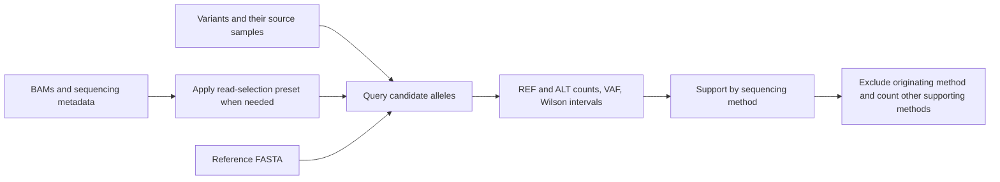

# RIVER

**Read-level Integration for Variant Evidence Recovery**

RIVER measures read support for candidate single-nucleotide variants across sequencing methods. Given candidate alleles and alignment files, it calculates reference and alternate counts, variant allele fractions, and confidence intervals, then reports how many other sequencing methods support each candidate.

A supporting method does not need to have called the variant. RIVER can compare bulk, duplex, and single-cell data, with presets for **IlluminaSeq, ppmSeq, UDSeq, NanoSeq, HiDEF-seq, and PTA-Seq**, and support for user-defined methods.

## Installation

### Reproducible Conda environment

Install [Miniforge](https://github.com/conda-forge/miniforge#install) or another Conda distribution first. From the repository root, run:

```bash
CONDA_CHANNEL_PRIORITY=strict conda env create -f environment.yml
conda activate river
python -m pip install --no-build-isolation --no-deps .
river --help
samtools --version
```

[environment.yml](environment.yml) installs Python, pysam, **the SAMtools command-line executable**, and the Python build tools. It pins the three runtime dependencies; it is not a platform-specific lockfile. The channel order and strict priority follow [Bioconda's installation guidance](https://bioconda.github.io/). Once installed, the demo requires no downloads.

### Existing Python environment and SAMtools installation

RIVER declares Python **3.9 or later** and pysam **0.22 or later**. These are package requirements, not a claim that every version combination has been tested. To install the tested SAMtools/pysam versions in an existing Conda environment:

```bash
conda install --override-channels -c conda-forge -c bioconda \
  --strict-channel-priority samtools=1.21 pysam=0.23.3
python -m pip install .
river --help
```

With a separately installed SAMtools executable, `python -m pip install .` installs RIVER and its Python dependency. Installing pysam alone does **not** put a standalone `samtools` executable on `PATH`; its bundled SAMtools library is separate. See the [pysam installation documentation](https://pysam.readthedocs.io/en/stable/installation.html) and [SAMtools source installation instructions](https://www.htslib.org/download/) for alternatives. RIVER accepts `--samtools /path/to/samtools` when the executable is not on `PATH`.

### Tested platform and versions

Validation on 2026-09-25 used **Rocky Linux 9.7, x86-64**, on a TSCC compute node. Other Linux distributions, macOS, and Windows/WSL have not been tested for this release.

| Environment | Python | pysam | External SAMtools / HTSlib | Validation |
|---|---|---|---|---|
| Existing TSCC environment | 3.12.12 | 0.23.3 | 1.18 / 1.18 | 20 existing tests plus the demo integration test |
| `environment.yml` | 3.12.12 | 0.23.3 | 1.21 / 1.24 | Fresh installation, installed demo and all 21 tests |

The pysam bundled SAMtools version is 1.21 in both environments. You can inspect the active versions with:

```bash
python --version
python -c 'import pysam; print("pysam", pysam.__version__, "bundled SAMtools", pysam.__samtools_version__)'
samtools --version
```

### Installation time and hardware

Allow approximately **5–10 minutes** for a fresh binary Conda installation with a working internet connection, and **under a minute** to install RIVER after dependencies are available. These are planning estimates; solver time, downloads, and shared filesystem load vary. Source builds can take longer. On the tested TSCC node, creating a new environment took **417 seconds (about 7 minutes)** with an existing Conda package cache available; installing RIVER took **2 seconds**. Conda itself was already installed. The dependency solve/install peaked at about **3 GB RAM**; allow at least **4 GB RAM for installation**.

- **Synthetic demo:** one CPU, 1 GB available RAM, and less than 1 MB for generated inputs/results; allow roughly 2–3 GB of disk for the environment and package cache. No GPU is needed.
- **Study data:** use a standard Linux workstation or compute node. Start with 1–2 CPUs and 4–16 GB RAM, then size the job for your BAMs and candidate count. Raw duplex selection tracks family identifiers in memory and writes selected BAMs, so large raw inputs may require more RAM and substantial extra disk. These are starting allocations, not measured bounds for full study data.
- **Cluster execution:** perform installation, the demo, and tests on a compute node. Slurm is optional for RIVER itself. Queue wait is excluded from runtimes.

## Runnable synthetic demo

After installation, one command from the repository root generates indexed inputs, runs RIVER, and checks all three output tables:

```bash
bash examples/run_demo.sh
```

The demo creates a 500-base artificial reference and four BAMs containing **45 alignments**, using the same approach as the synthetic test fixtures. It needs no study BAMs or GRCh38 download. It exercises raw ppmSeq selection, bulk and single-cell evidence, repeated variant origins, all three other-method support classes, and an uncovered candidate.

Results appear in `examples/demo/results/`. The checked-in [expected tables](examples/expected/) contain 12 read-support rows, 4 variant-support rows, and 2 summary rows. The command finishes with:

```text
Demo matches expected tables: 12 read rows, 4 variant rows, 2 summary rows.
```

The complete demo took **0.49 seconds** on the tested node; allow **under 10 seconds** after installation on one CPU. See [the demo guide](examples/README.md) for measured runtime, expected counts, individual commands, and rerunning in a new directory.

## Quick start

Provide two tab-separated files, indexed BAMs, and an indexed GRCh38 reference FASTA:

```bash
river run \
  --variants variants.tsv \
  --samples samples.tsv \
  --reference GRCh38.fa \
  --outdir river_results
```

Choose a new output directory for each run. RIVER refuses to overwrite an existing directory. Use `--threads` to set BAM-preparation threads.

On a Slurm cluster, submit from the repository directory using your account and partition:

```bash
sbatch --account=ACCOUNT --partition=PARTITION \
  scripts/run_river.sbatch variants.tsv samples.tsv GRCh38.fa river_results
```

The job script also works without installing the package. It reads source code from `src/`; set `RIVER_PYTHON` and `RIVER_SAMTOOLS` if the executables are not on `PATH`. Adjust job time and memory for your dataset, especially when selecting reads from full-depth raw duplex BAMs.



Use one run for one biological comparison group. Each BAM represents one sequencing dataset or one cell. Apply application-specific candidate filters before supplying the variant table; RIVER evaluates the candidates provided.

## Inputs

The tables below illustrate study inputs; replace their coordinates and paths with your own candidate alleles and alignments. The separate [`examples/` demo](examples/README.md) generates fully runnable synthetic inputs.

### 1. `variants.tsv`: candidates and their origins

```tsv
chrom	pos	ref	alt	source_sample_id
chr1	100001	A	G	brainA_udseq
chr1	100001	A	G	brainA_illumina
chr2	200002	C	T	brainA_pta_cell01
```

| Column | Description |
|---|---|
| `chrom` | GRCh38 chromosome name matching the BAM and reference. |
| `pos` | 1-based genomic position. |
| `ref` | Single reference base: A, C, G, or T; must match the reference FASTA. |
| `alt` | Single alternate base: A, C, G, or T; must differ from `ref`. |
| `source_sample_id` | Dataset that originally called this variant; matches `sample_id` in `samples.tsv`. |
| `callset` *(optional)* | Label for separate summaries, such as `singleton` or `multiread`. |

The sequencing method of origin is obtained from `samples.tsv`, so it does not need to be repeated on every variant row. The allele key is `(chrom, pos, ref, alt)`. An allele called in several datasets appears once for each source dataset, as in the example; RIVER queries the unique allele once per BAM and retains each origin for classification. Duplicate allele/source/callset rows do not add observations or increase denominators.

### 2. `samples.tsv`: alignments and sequencing metadata

```tsv
sample_id	method	type	bam
brainA_illumina	IlluminaSeq	bulk	bams/illumina.bam
brainA_ppmseq	ppmSeq	duplex	bams/ppmseq.bam
brainA_udseq	UDSeq	duplex	bams/udseq.bam
brainA_nanoseq	NanoSeq	duplex	bams/nanoseq.bam
brainA_hidef	HiDEF-seq	duplex	bams/hidef.bam
brainA_pta_cell01	PTA-Seq	single_cell	bams/pta_cell01.bam
brainA_pta_cell02	PTA-Seq	single_cell	bams/pta_cell02.bam
```

| Column | Description |
|---|---|
| `sample_id` | Unique dataset identifier; use one row per BAM and one BAM per single cell. |
| `method` | Sequencing-method name. Select a preset name or supply a name for a new method. Datasets with the same name contribute to the same method. |
| `type` | `bulk`, `duplex`, or `single_cell`; determines the support rule. |
| `bam` | Path to a coordinate-sorted BAM with a neighboring BAI or CSI index. Relative paths are resolved from the sample table's directory. |

Include every dataset to be queried, including datasets that did not call any candidate. Any subset of the presets can be used, with any number of single cells; six methods and 16 cells are not required. A source-only metadata row may use `.` for `bam` when its alignment will not be queried. At least one query BAM is required.

The following are **optional columns in the same sample table**, not additional input files:

| Column | When to use it |
|---|---|
| `preset` | Use another method's compatible preparation settings. Defaults to `method` when it is a recognized preset. |
| `bam_state` | For duplex data, `raw` applies preparation and `selected` uses an already selected BAM. Default: `raw`. |
| `strand_source` | Source of orientation labels: `sam_flags`, `read_name`, or `tag:TAG`. Presets provide defaults. |
| `fwd_pattern`, `rev_pattern` | Forward/reverse definitions. With `sam_flags`, use `forward`/`reverse` or `F1R2`/`F2R1`. With read names or tag values, use regular expressions. |
| `family_tag` | BAM tag containing the molecule identifier for custom duplex selection, for example `MI`. |

For bulk data, the default orientation is BAM forward/reverse. Paired-end data can instead specify F1R2/F2R1, where F1R2 means read 1 forward or read 2 reverse, and F2R1 means read 1 reverse or read 2 forward. Forward, reverse and unclassified observations are reported separately and summed for VAF; alternate support on both orientations is not required. A read matching neither configured label remains in bulk/selected-BAM totals. A read matching both labels is an error.

All alignments and variants in a run must use the same GRCh38 reference coordinates and compatible contig names and lengths. Missing files, invalid allele keys, inconsistent method/type assignments, and failed pileup commands are input or execution errors, rather than zero-support observations. Assign each BAM to one dataset only; repeating an alignment under several sample IDs does not provide independent evidence.

Read names and strand-tag values must not contain commas, because SAMtools uses commas to separate per-read metadata. RIVER reports ambiguous metadata as an error.

## Sequencing presets

Presets define expected read names/tags and any selection needed before pileup. They do not require a variant call from the supporting dataset.

| Preset | Type | Read selection and orientation |
|---|---|---|
| `IlluminaSeq` | `bulk` | Standard BAM input; forward/reverse from alignment flags. |
| `ppmSeq` | `duplex` | Retain reads with both `st == MIXED` and `et == MIXED`; exclude secondary, supplementary, QC-failed and duplicate-marked reads. |
| `UDSeq` | `duplex` | Group reads by alignment start and orientation-normalized UMI pair within each chromosome; require F1R2 and F2R1 representation. |
| `NanoSeq` | `duplex` | Same family-selection rule as UDSeq. |
| `HiDEF-seq` | `duplex` | Group by ZMW identifier and require both `fwd` and `rev` read-name labels. |
| `PTA-Seq` | `single_cell` | Query each cell separately and combine qualifying cells into one method-level support flag. |

For raw UDSeq/NanoSeq input, query names must end in `_UMI1+UMI2`. Selection requires proper pairs and excludes secondary, supplementary, QC-failed and `DT`-tagged reads. It also rejects a read when the **first CIGAR operation has length 4**, regardless of operation type. UMI order is normalized by read number and orientation before grouping. This rule is retained in both presets.

For raw HiDEF-seq input, slash-delimited query-name field 2 supplies the ZMW identifier and field 4 supplies `fwd`/`rev`. The selection key is the ZMW identifier alone, so identifiers must be unique across the input movies. Secondary, supplementary, QC-failed and duplicate-marked reads are excluded. The duplex preparation presets cover chromosomes 1–22 and X.

If duplex alignments already satisfy the intended selection, set `bam_state` to `selected`. Read selection retains eligible alignments; it does not generate a new consensus or require alternate-allele agreement between strands at a candidate site.

Use preset strand definitions for raw preset input. Custom orientation settings apply to bulk data, selected BAMs, or a custom raw duplex scheme. Populated raw ppmSeq inputs must contain the `st`/`et` tags, and raw HiDEF-seq inputs must contain recognizable strand labels; entirely unrecognized input is reported as a format error. Correctly formatted reads may still yield no eligible duplex families.

## Adding a sequencing method

Set `method` to the new method's name and choose its `type`. The method name controls grouping and exclusion of the originating method; the preset controls read preparation. Reusing a preset does not rename the method.

For a new duplex method, the simplest input is an already selected BAM:

```tsv
sample_id	method	type	bam	bam_state
brainA_custom	MyDuplex	duplex	bams/my_duplex.selected.bam	selected
```

Raw data may reuse a compatible preset by adding, for example, `preset=UDSeq` to the sample row. The BAM must satisfy that preset's read-name, tag and pairing requirements.

A custom tag-based duplex scheme can instead provide its molecule and strand definitions in the same table:

```tsv
sample_id	method	type	bam	bam_state	strand_source	fwd_pattern	rev_pattern	family_tag
brainA_custom	MyDuplex	duplex	bams/my_duplex.bam	raw	tag:DS	^F$	^R$	MI
```

Here, `MI` identifies the molecule and `DS` contains `F` or `R`. Selection groups by chromosome and molecule ID and retains eligible, strand-labeled reads from families represented by both labels. Molecule IDs must distinguish families within each chromosome. Custom selection excludes secondary, supplementary, QC-failed and duplicate-marked reads. Remaining reads must carry the family tag; unmatched strand labels are skipped and counted in preparation statistics. If every eligible read has an unrecognized label, selection reports a format error. Both strand definitions and a family identifier are needed for this selection; forward/reverse labels alone do not establish duplex membership. An incompatible or unspecified raw duplex scheme must be resolved before querying.

## Evidence and decision rules

### Read counts and VAF

Candidate sites are queried with SAMtools using:

```text
mpileup -Q 13 -q 0 -A -B \
  --ff SECONDARY,QCFAIL,DUP,SUPPLEMENTARY -d 1000000
```

The reference FASTA, BAM and candidate region are supplied for each query. Default overlapping-mate handling remains enabled. Reference and alternate counts sum retained observations across orientations:

```text
depth = REF_COUNT + ALT_COUNT
VAF   = ALT_COUNT / depth
```

Other alleles are excluded from this denominator. RIVER reports two-sided 95% Wilson score intervals with `z = 1.959963984540054`. VAF and interval bounds are undefined when depth is zero. Counts refer to retained read observations, not necessarily unique molecules.

### Support within a method

| Input type | Qualifying evidence |
|---|---|
| `bulk` or `duplex` | Lower 95% Wilson VAF bound **> 0.001**. |
| `single_cell` | At least one alternate observation in a cell; at least one qualifying cell supports the method. |

The bulk/duplex comparison uses unrounded intervals and has no additional minimum-depth or fixed alternate-count threshold. No per-site agreement between strands is required.

For multiple BAMs assigned to the same bulk/duplex method, evaluate each BAM separately and mark the method supported if any qualifies; do not pool counts across BAMs. For single-cell methods, record the identities and number of qualifying cells, including exactly-one and at-least-two categories. Every method contributes at most one vote, regardless of its number of BAMs or cells.

### Support from other methods

For each candidate and its origin, RIVER:

1. Resolves the originating method from `source_sample_id`.
2. Excludes that entire method from the support tally, including any other BAMs assigned to it.
3. Counts the remaining supported methods and assigns **0**, **1**, or **≥2** other-method support.

For example, a UDSeq-origin candidate supported by UDSeq, IlluminaSeq and two PTA cells has **two other supporting methods**: IlluminaSeq and PTA-Seq.

Summaries are grouped by source sample and method, with separate groups for an optional `callset`. Each denominator includes all submitted unique candidates in that group, even if they fail their originating method's own support threshold. With `M` methods available, the number of other supporting methods can range from zero to `M - 1` when the originating method is among them.

Zero qualifying support does not establish a false-positive call. A successfully queried site with zero REF/ALT depth contributes no support and remains in the denominator; its lack of coverage is recorded separately.

## Outputs

| File | Contents |
|---|---|
| `read_support.tsv` | One row per unique allele and queried dataset: sample, method, REF/ALT counts, depth, VAF, Wilson interval, qualifying-support flag, coverage/query status, and orientation counts. |
| `variant_support.tsv` | One row per allele/origin/callset: source sample and method, supporting datasets/methods, supporting-cell counts, identities and 0/1/≥2 classes by method, other supporting methods, their number, and the 0/1/≥2 category. |
| `summary.tsv` | Candidate denominators and counts/proportions in each support category, grouped by source sample, method and optional callset. Proportions are undefined for empty groups. |
| `run.json` | Effective input settings, method definitions, thresholds and completion status. |

`ref_forward`, `ref_reverse`, `alt_forward`, and `alt_reverse` use each dataset's configured labels. The corresponding `*_unclassified` columns capture observations matching neither label. Each allele's three orientation counts sum to its total. Undefined numerical values are written as `NA`; list and dictionary fields are JSON within quoted TSV cells.

Selected BAMs and candidate positions are retained under `intermediate/` when needed. They do not replace the supplied alignments. Final result tables are published only after all datasets have completed; `run.json` records completion or failure and includes any preparation statistics.

## Requirements

- Python 3.9 or later with pysam.
- SAMtools on `PATH` or supplied with `--samtools`; see the tested versions and installation commands above.
- Coordinate-sorted, indexed BAMs and the matching indexed GRCh38 FASTA for study analyses. The demo uses its own artificial reference.

No separate call-set mapping, annotation matrix or cluster scheduler is required by the input interface.

## Tests

The test suite creates small synthetic references and BAMs to check read selection, pileup parsing, confidence intervals, method grouping, input errors, and output handling. It also runs the demo and compares every output column with the checked-in expected tables. Run it on Slurm from the repository directory:

```bash
sbatch --account=ACCOUNT --partition=PARTITION scripts/test.sbatch
```

Set `RIVER_PYTHON` to your Python executable and `RIVER_TEST_SAMTOOLS` if SAMtools is not on `PATH`. Outside a cluster, the same suite can be run with `PYTHONPATH=src python -m unittest discover -s tests -v`.

## License

RIVER is distributed under the [MIT License](LICENSE). Copyright (c) 2026 RIVER contributors.
